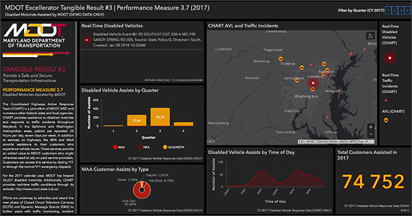

## Monitoreo sobre el estado de las instalaciones de seguridad en tiempo real de Finca 2, Universidad de Costa Rica
### Descripcion del proyecto

 
El monitoreo del estado de instalaciones de seguridad es fundamental para garantizar la integridad, funcionalidad y seguridad de infraestructuras críticas. Este proceso implica la vigilancia continua y el análisis en tiempo real de diversos elementos de seguridad, como barreras físicas (agujas de seguridad),  alumbrado publico, hidrantes, entre otros. Un sistema eficaz de monitoreo permite la detección temprana de fallos, el mantenimiento predictivo y una respuesta rápida ante cualquier anomalía, asegurando la protección de las instalaciones y la prevención de incidentes. Ademas, permite tomar decisiones con mayor facilidad y menor tiempo.
> 
Tomado de [ArcGis dashboards](https://www.ucr.ac.cr/mapas/sede-central/laboratorio-nacional-de-materiales-y-modelos-estructurales-lanamme.html)
### Datos y variables

 
En este proyecto se obtendran los datos a partir de los reportes que los usuarios provean al servicio de mapeo en tiempo real. Ademas, si el equipo que se considera en este proyecto lo permite se tomaran los datos a partir de sensores que reporten el estado del equipo. Dentro de las variables a considerar en el mapa se tienen las siguientes:
- **Funcionamiento del dispositivo:** sera un espacio donde el usuario podra reportar un averia del equipo a traves de la interfaz de la aplicacion. Ademas, si las condiciones lo permiten, se usara un sensor para automatizar esta accion.
- **Estado del equipo:** se entiende como la condicion en la que se encuentra este, para ello se identificara como "en buen estado", "requiere mantenimiento" y "deteriorado". Esta variable, sera controlada por los administradores de la base de datos.
- **Ubicacion:** con el objetivo de identificar cada objeto, se dispondra de coordenadas especificas que permitan identificarse individualmente en el mapa.
- **Nombre del equipo:** esta variable se usara para identificar la categoria a la que pertenece cada objeto, entre ellas "hidrante", "agujas de parqueo", "agujas de salida con guarda de seguridad" y "agujas de salida de salida con tarjeta".
- **Descripcion o datos adicionales:**   este espacio se brinda para que se hagan observaciones adicionales sobre el equipo o anuncios sobre la suspension del servicio por mantenimiento o reparacion. 
- **Numero de contacto:** el numero que corresponda para cada unidad encargada de la reparacion o mantenimiento del equipo.   

Todas las variables, exceptuando la primera, seran modificadas por las personas que gestionen los datos. El objetivo, es que, la primer variable sirva como un reporte de tiempo real y que las personas que observen una averia, lo indiquen en el tiempo mas corto. Una vez se haya atendido esta situacion, el equipo se restablecera a "en funcionamiento".

### Justificacion del problema

La [Oficina de Servicios Generales (OSG)](http://www.osg.ucr.ac.cr/index.php) en su pagina especifica que es
>"La dependencia encargada de coadyuvar en la prestación de servicios de apoyo a las actividades sustantivas de la Institución, para el óptimo desarrollo de la docencia, investigación y acción social." (OSG, 2024)

Por lo tanto, es la entidad responsable del mantenimiento y gestion del transito interno. Su pagina se compone principalmente de secciones de informacion sobre los [servicios](http://www.osg.ucr.ac.cr/index.php/ps) y [documentos](http://www.osg.ucr.ac.cr/index.php/documentos/direccion) varios con circulares de cambios aplicados. Sin embargo, no se puede consultar el estado del equipo y en general, se torna dificil buscar la informacion dentro de esta pagina en relacion a matenimiento o averias. 

Por otro lado, la pagina de la UCR cuenta con un [mapa](https://www.ucr.ac.cr/mapas/sede-central/laboratorio-nacional-de-materiales-y-modelos-estructurales-lanamme.html) interactivo, que permite la consulta sobre ciertas instalaciones de dentro del campus. Este mapa, muestra en forma de _Pop Up_ la informacion de contacto, su pagina y ubicacion de los **edificios**. Sin embargo, es un mapa con poca informacion de relevancia, ya que, no muestra mas datos relevantes sobre actualizaciones del estado sobre infraestructura de seguridad y es un mapa poco conocido.

> Imagen tomada de la pagina oficial de la [Universidad de Costa Rica (UCR)](https://www.ucr.ac.cr/mapas/sede-central/laboratorio-nacional-de-materiales-y-modelos-estructurales-lanamme.html)

Esta falta de informacion, difusion y sumado al mal diseño (no es atractivo visualmente), ha generado que recursos como estos se desaprovechen. Es necesario plantear dentro del campus universitario mediciones a tiempo real que permitan alertar sobre el estado de las instalaciones, debido a que: 
1. Puede mejorar la distribucion de los recursos
2. Permite tomar acciones con mas eficiencia 
3. Proporciona al publico general la informacion de forma intuitiva y permite la constante retroalimentacion

Por esto, muchas partes de la universidad se verian beneficiadas por este servicio y daria paso a la innovacion, la cual, puede ya no solo contemplar unicamente infraestructura de seguridad, sino, actualizaciones sobre el estado del autobus interno, caidas de arboles, inundaciones o para la misma orientacion de los estudiantes, la cual suele ser uno de los principales temores al momento de ingresar a la universidad.     

